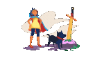
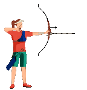
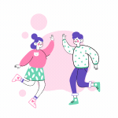
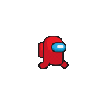

<div align="center">
  
</div>

<p align="center">  </p>

## GitHub Stats:

<p align="center">
  
  
  
</p>

<p align="center">  
  
  
  
</p>

<p align="center">
  
  
  
  
</p>

<p align="center">
  
  
  
</p>

<!-- Proudly created with GPRM ( https://gprm.itsvg.in ) -->


```
>======>         >===>          >===>          >===>          >===>          >===>
>=>    >=>     >=>    >=>     >=>    >=>     >=>    >=>     >=>    >=>     >=>    >=>
>=>    >=>   >=>        >=> >=>        >=> >=>        >=> >=>        >=> >=>        >=>
>> >==>      >=>        >=> >=>        >=> >=>        >=> >=>        >=> >=>        >=>
>=>  >=>     >=>        >=> >=>        >=> >=>        >=> >=>        >=> >=>        >=>
>=>    >=>     >=>     >=>    >=>     >=>    >=>     >=>    >=>     >=>    >=>     >=>
>=>      >=>     >===>          >===>          >===>          >===>          >===>

```

<p>
  
  
 
 
</p>
