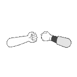
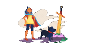
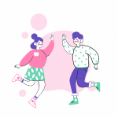
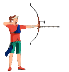
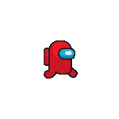

<!-- First GIF (Updated)-->
<div align="center">
  
</div>

<!-- Visitor Badge (Updated)-->
<p align="center">  </p>

<!-- Typed Text -->
[](https://github.com/whiteSHADOW1234/TypingSVG)

<!-- Activity Graph (Updated)-->
[](https://github.com/ashutosh00710/github-readme-activity-graph)

<!-- Github Stats (Total Commit) (Updated)-->
<p align="center">
  
  
  
  
</p>

<p align="center">
  
  
  
  
  
</p>

<!-- Random Quote (Updated)-->
<p align="center">
  
  
  
</p>

```
>======>         >===>          >===>          >===>          >===>          >===>
>=>    >=>     >=>    >=>     >=>    >=>     >=>    >=>     >=>    >=>     >=>    >=>
>=>    >=>   >=>        >=> >=>        >=> >=>        >=> >=>        >=> >=>        >=>
>> >==>      >=>        >=> >=>        >=> >=>        >=> >=>        >=> >=>        >=>
>=>  >=>     >=>        >=> >=>        >=> >=>        >=> >=>        >=> >=>        >=>
>=>    >=>     >=>     >=>    >=>     >=>    >=>     >=>    >=>     >=>    >=>     >=>
>=>      >=>     >===>          >===>          >===>          >===>          >===>

```

<p>
  
  
  
  
</p>
